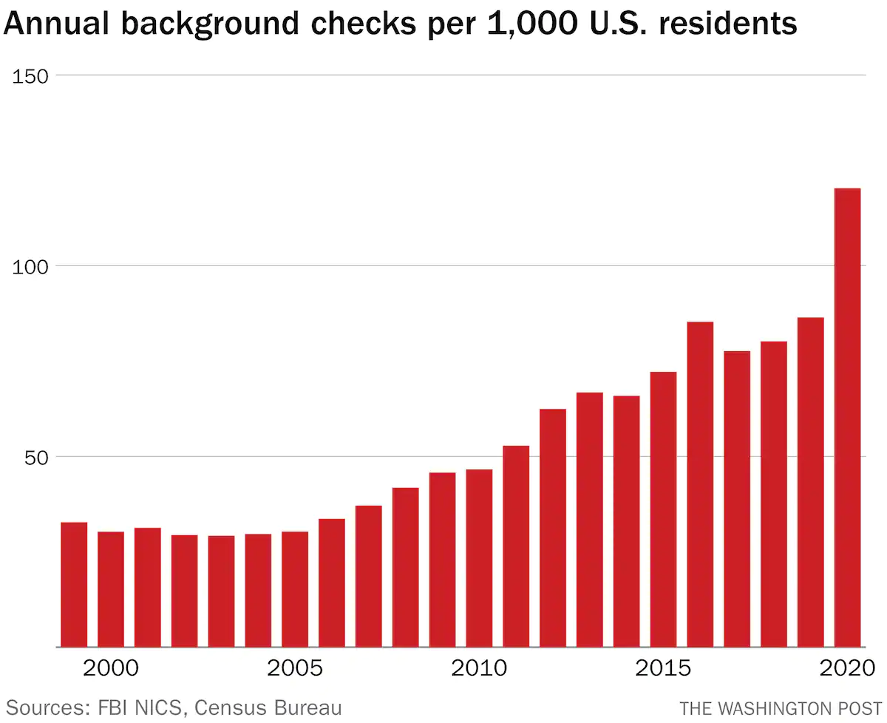
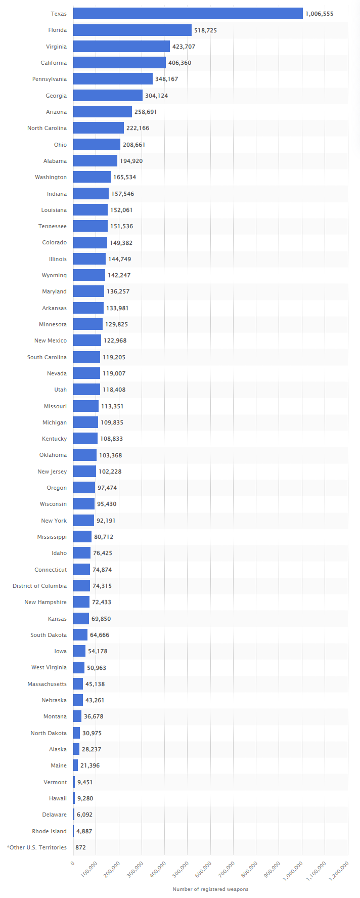

# Are people getting more inclined to purchase firearms?

## Group Members
- Xiuyuan Wang: xiuyuan7
- Jing Wang: jingw13
- Yichen Huang: yichenh8

## What is our dataset about?
According to FBI’s National Instant Criminal Background Check System: “Mandated by the Brady Handgun Violence Prevention Act of 1993 and launched by the FBI on November 30, 1998, NICS is used by Federal Firearms Licensees (FFLs) to instantly determine whether a prospective buyer is eligible to buy firearms or explosives. Before ringing up the sale, cashiers call in a check to the FBI or to other designated agencies to ensure that each customer does not have a criminal record or isn’t otherwise ineligible to make a purchase. More than 100 million such checks have been made in the last decade, leading to more than 700,000 denials.”
So here we can say that background check is not equal to a deal of firearm sale, because people can 1.) fail the check or 2.) pass the check but decide not to proceed with the purchase.

## Why are we interested in the dataset?
Even though the background check statistics do not equal the number of firearms sold, the two are strongly correlated. So from our perspective, background check data can provide us with insights into purchasing trend of firearms.
Over the years, public disagreement over laws of firearm ownership is only getting deeper. In the meantime, the number of total violent crime reported in the United States is rising. We are interested in the relationship between people’s ownership of firearms and the crime rate.

## Our topic of interest
We would like to look at how the total checks change along with time and inspect how political attitudes may be reflected in the trend of gun checks. In order to do this, we first need to add a column to our dataset, political with nominal values: the swing states, blue states and red states. Then we will draw a line plot with 3 lines, each for a political standing. And the x-axis is the year, the y-axis is the number of total checks.

## Central Visualization

<vegachart schema-url="{{ site.baseurl }}/assets/json/final_project_main_chart.json" style="width: 100%"></vegachart>

From the above diagram we generated, the total number of gun checks of each state in the United States are increasing by years, no matter how the political leanings of government changes. In addition, states with Republican political standing has continuously higher number of total checks than states with Democratic political standing. Finally, swing states and democratic states have more fluctuation in the chart, which means the intention of purchasing weapons of residents in these states is easier to be influenced by government's policies. However, in republican states, the trend of this intention continuously increases.

## Contextual Visualization 1

The above diagram is showing the number of background checks per year in every 1000 U.S. residents. This visualization is from the website the Washington Post and is generated by Philip Bump according to government data. The source link of this visualization is https://www.washingtonpost.com/politics/2021/12/03/patterns-gun-sales-united-states-visualized/.

## Contextual Visualization 2

The above diagram is showing, in the United States, each state's total number of registered weapons in 2021. This visualization is from the website Statista.com and is generated according to government data and published by Statista Research Department on Oct 19, 2021. The source link of this diagram is https://www.statista.com/statistics/215655/number-of-registered-weapons-in-the-us-by-state/.

<!-- these are written in a combo of html and liquid --> 





